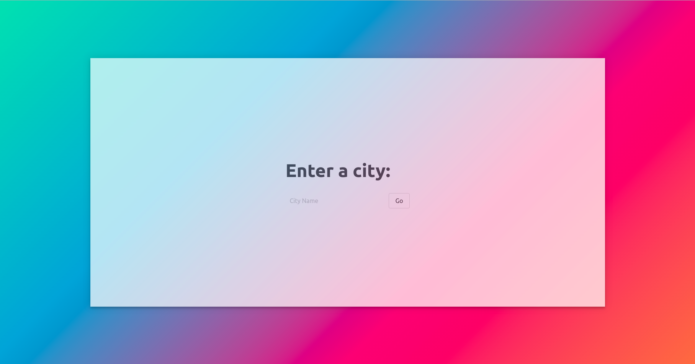
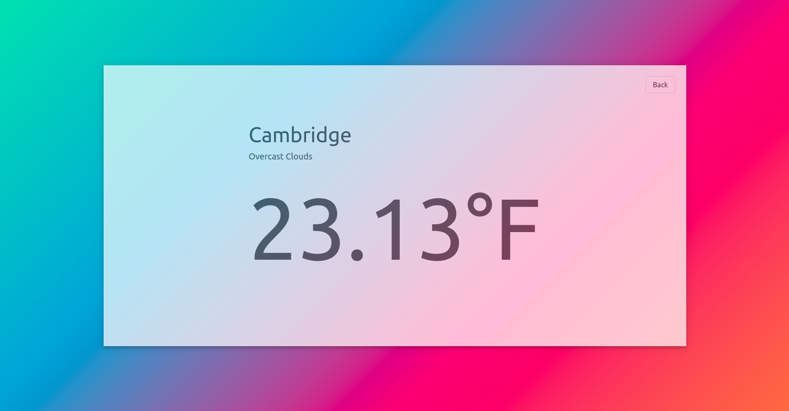

# Weatherapp

This is a simple Weather App that uses Angular and Open Weather Map API.

[Open Weather Map](https://openweathermap.org) 

## API Setup
If you don't have one already, you can get an API key from the [Open Weather App](https://openweathermap.org/api) website. 

Once you have generated a key, make a copy of the `environment.ts` file. Rename the file `environment.dist.ts` and paste in your api key. It should look similar to this: 

```typescript

export const environment = {
  production: false,
  apikey: <yourkeyhere>
};

```

## To run
Run `ng serve` in the command line to get started.

## Example

#### Question Page


#### Result Page



